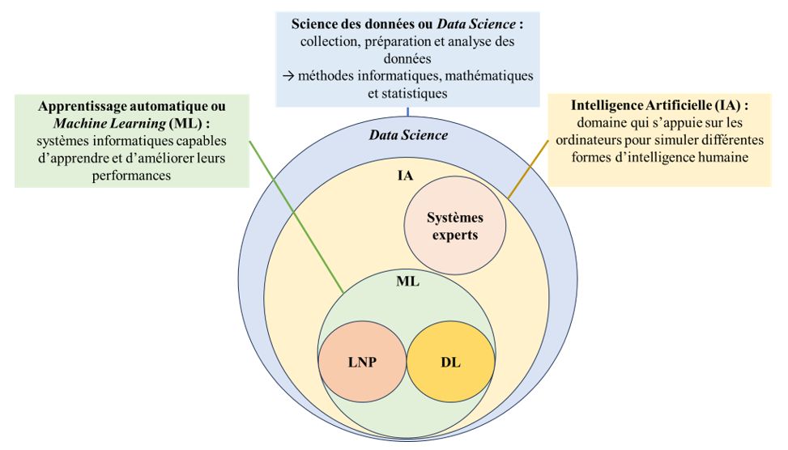
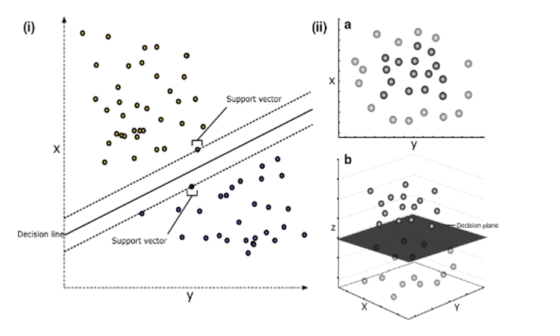

# Les domaines de l’Intelligence Artificielle

La science des données ou Data Science et l’IA sont devenus des outils précieux dans de nombreux domaines y compris en médecine en particulier lorsque les données médicales sont volumineuses et hétérogènes (mégadonnées ou Big Data) [2] [26] [1]. La Data Science met en jeu de nombreux domaines comme par exemple l’informatique et les mathématiques (dont les statistiques) et constitue une nouvelle approche dans le monde médical [27]. L'IA qui appartient à la Data Science comprend différents sous-domaines comme par exemple : (i) l’apprentissage automatique (ML) qui inclut les réseaux neuronaux artificiels (Artificial Neural Networks) et l’apprentissage profond (DL) (ii) le LNP et (iii) les systèmes experts (Figure 2). Le ML est le domaine de l’IA particulièrement utilisé en médecine y compris en microbiologie médicale comme dans le cadre de ce travail. C’est pourquoi la suite de cette introduction se concentre sur ce domaine.

  

## Figure 1. Représentation schématique des relations entre les différents domaines de la science des données (Data Science)
Les domaines représentés incluent l’Intelligence Artificielle (IA) les systèmes experts l’apprentissage automatique (Machine Learning ML) le traitement du langage naturel (Natural Language Processing NLP) et l’apprentissage profond (Deep Learning DL).

Lorsque la résolution d'un problème s'avère complexe la conception d'un programme informatique peut nécessiter des tâches et conditions trop nombreuses et complexes à formuler en raison des multiples scénarios à prendre en compte. Dans ces cas le recours au ML peut être une approche intéressante. Cela nécessite la création d'un programme informatique qui exploite des algorithmes également désignés comme des modèles mis au point par des développeurs ingénieurs ou chercheurs capables d'apprendre de manière autonome via un processus d'entraînement. 

Plusieurs types d’apprentissage peuvent être utilisés :

- L'apprentissage non supervisé qui consiste à entraîner un algorithme pour découvrir des structures sous-jacentes permettant de classer des données non étiquetées. Les principaux algorithmes d’apprentissage non supervisé utilisés sont la classification par clustering avec l’algorithme K-means et l'analyse en composantes principales (PCA) [28] [29].
- L’apprentissage supervisé qui consiste à entraîner un modèle sur des données d'entraînement étiquetées pour prédire des valeurs ou des classes. Les principaux algorithmes d’apprentissage supervisé utilisés sont la régression linéaire ou logistique les machines à vecteurs de support (Support Vector Machine SVM) les arbres de décision et les forêts aléatoires les réseaux de neurones (y compris les techniques de DL) et la méthode Gradient Boosting Machine [30]. 
- L’apprentissage semi-supervisé qui consiste à utiliser des données partiellement étiquetées permet d’obtenir des prédictions sur des classes encore non labellisées.
- L’apprentissage par renforcement qui consiste pour un système autonome à interagir avec son environnement pour trouver la stratégie de décision qui maximisera sa « récompense » au fil du temps.

## Les principaux algorithmes supervisés de Machine Learning

Dans le cadre de l’apprentissage supervisé les algorithmes de ML sont des programmes informatiques capables d’effectuer des prédictions (output) à partir de données d’entrées (input ou features ou encore variables). Ces prédictions peuvent être qualitatives ou quantitatives.

### La régression linéaire et logistique

La régression est probablement l’un des algorithmes les plus connus. L’objectif de la régression est de décrire les relations explicatives entre une variable à expliquer et une seule (régression simple) ou plusieurs variables (régression multiple). La variable à expliquer ou prédire peut-être quantitative (régression linéaire) ou qualitative (régression logistique) [31]. Il s’agit donc de prédire une valeur Y à l’aide d’une ou plusieurs variables X (X1 X2 X3 …). Par exemple dans le cadre de la résolution d’un problème de classification à l’aide d’une régression logistique simple (prédiction d’une valeur binaire (oui/non)) la fonction logistique est une fonction sigmoïde (courbe en S). Cette fonction permet d’obtenir des valeurs de sortie entre 0 et 1. Ainsi en appliquant un seuil de décision à 05 les prédictions peuvent être réparties entre les deux catégories (> 05 ou < 05).

### Les machines à vecteurs de support (Support Vector Machine SVM)

Le SVM ou séparateur à vaste marge ou machine à vecteur de support ou encore Support Vector Machine sont des algorithmes puissants qui peuvent effectuer des classifications linéaires ou non-linéaires et des régressions sur des jeux de données complexes [32] (Figure 3). L’objectif des SVM consiste à projeter les données dans un espace à plusieurs dimensions pour trouver le meilleur hyperplan (classificateur) c’est-à-dire celui qui maximise la marge entre les différentes classes pour les séparer. La marge correspond à la distance entre la frontière de décision et les échantillons les plus proches. Lors du processus d’entraînement l’algorithme va chercher le meilleur hyperplan pour trouver la marge la plus large entre les échantillons appelés vecteurs de supports les plus proches des différentes classes à séparer. Si les données ne sont pas séparables linéairement celles-ci seront projetées dans un espace avec plus de dimensions appelé « espace de redescription » grâce à une fonction appelée noyau (concept de kernel trick ou astuce du noyau) pour les rendre séparables linéairement.

  

## Figure 2. Exemple de sortie graphique d’un algorithme de type Support Vector Machine simple d’après Handelman et al. [33] 
La séparation linéaire de données bidimensionnelles (i) peut parfois s'avérer impossible (iia) ; cependant la transformation du noyau permet de séparer les données en dimensions supérieures (iib). 

### Les arbres de décision et forêts aléatoires (Random Forest RF)

Au même titre que les SVM les arbres de décision sont des algorithmes polyvalents capables de résoudre des problèmes de régression et de classification. Lors de l’entraînement l’algorithme cherchera à établir des règles de décision pour séparer les données selon leurs caractéristiques appelées aussi variables discriminantes. Ces règles de décisions sont ramifiées et peuvent être représentées sous forme d’un arbre de décision à l’aide d’une structure représentée par des nœuds. Les arbres de décision sont l'élément de base de plusieurs modèles comme les forêts aléatoires (Random Forest RF) [34]. L’algorithme RF repose sur un apprentissage combiné de multiples arbres de décision entraînés (Decision Tree DT) sur différents sous-ensembles de données dont les prédictions sont assemblées (Figure 4). Cette technique consistant à créer plusieurs algorithmes pour les entraîner en parallèle et grouper les prédictions s’appelle le bagging.

## Figure 4. Représentation schématique de l’algorithme Random Forest d’après Zou et al. [35]

### Machine de renforcement de gradient (Gradient Boosting Machine GBM)

L’algorithme Gradient Boosting Machine (GBM) utilise aussi comme structure de base les arbres de décision [36]. Alors que l’algorithme RF repose sur l’entraînement de plusieurs algorithmes en parallèle l’algorithme GBM utilise un ensemble d’arbres de décision entraînés successivement. Ainsi chaque nouveau modèle tente de compenser les erreurs du précédent (Figure 5). Cette technique consistant à construire un modèle de manière progressive s’appelle le boosting.

## Figure 5. Représentation schématique de l’algorithme Gradient Boosting Machine d’après Deng et al. [37]

### Les techniques d’apprentissage profond 

Le DL est un sous-domaine du ML qui utilise diverses architectures de réseaux de neurones comme algorithmes [38]. L’unité de base est appelée neurone formel ou artificiel ou encore perceptron et peut être comparé à une représentation mathématique et informatique d’un neurone biologique. Un neurone biologique capte des informations sous forme de signaux électriques via des dendrites qui vont arriver jusqu’au corps cellulaire qui comprend un noyau. Si la somme des signaux reçus dépasse un certain seuil l’information traitée se propage le long de l’axone pour être transmise aux neurones suivants via la synapse qui est le lieu de connexion entre deux neurones (connexion dendrite-axone). 

Dans le cadre d’un neurone artificiel (Figure 6.a) les entrées peuvent être comparées aux dendrites. Chacune des entrées est multipliée par un poids synaptique qui permet de moduler leur importance. La somme de ces entrées pondérées est alors calculée et le résultat est transmis à une fonction mathématique d’activation qui génère une sortie qui peut être comparée à l’axone. Cette donnée de sortie peut alors être transmise à un autre neurone formel comme donnée d’entrée. Plusieurs types de fonctions linéaires ou non-linéaires (fonction sigmoïde fonction tangente hyperbolique appelée Tanh pour hyperbolic tangent Unité rectifiée linéaire appelée ReLU pour Rectified Linear Unit) peuvent être utilisés. Une architecture d’apprentissage profond correspond à un empilement multicouche de neurones formels appelé réseau de neurones profonds capable de résoudre des problèmes complexes. Pour faire un parallèle avec le neurone biologique les poids peuvent être comparés à l'impact des signaux électriques transmis entre les neurones biologiques (forces de connexion synaptique).

Il existe différentes architectures pour les réseaux neuronaux dont voici quelques exemples :

- Le perceptrons multicouche (Multilayer Perceptron MLP) : c’est l’architecture la plus ancienne dont la structure est composée de différentes couches cachées connectées entres elles. Les sorties de chacune des couches sont des entrées pour les suivantes (Figure 6.b).
- Le réseau de neurones convolutif (Convolutional Neural Network (CNN)) : ce type de réseau possède une architecture singulière inspirée du cortex visuel des mammifères et est particulièrement adapté au traitement de l’image. La structure est composée d’une couche de convolution servant de filtre pour extraire les caractéristiques importantes d’une image qui sera transformée en une carte de convolution et d’une couche permettant d’agréger les données à partir de sous-échantillons de la carte de convolution appelée couche de pooling.

## Figure 6. Représentation schématique des structures de perceptron d’après Zou et al. [35]
(a) structure d’un perceptron qui comprend une couche d’entrée (Input layer) et une couche de sortie (Output layer) ; (b) structure d’un perceptron multicouche qui comprend une couche d’entrée (Input layer) une couche cachée (Hidden layer) et une couche de sortie avec deux neurones correspondant aux nombres de classes à séparer. 

## Utilisation du Machine Learning pour un algorithme d’apprentissage supervisé 

Après avoir posé une problématique et défini un objectif les différentes étapes de la résolution de cette problématique en utilisant le ML peuvent être résumées de la manière suivante [39] [40] [41] [30] (Figure 7) :

- Importer et inspecter le jeu de données initial. Après l’import des données dans un environnement comme python ou R il est primordial de vérifier que les données sont de bonne qualité (gestion des données manquantes vérifier la cohérence des données etc.). Il est aussi utile d’inspecter les données à l’aide de techniques non supervisées (PCA par exemple) pour examiner la présence de données aberrantes.
- Préparer les jeux de données. Lors de cette étape un jeu de données initial est séparé en un jeu d’entraînement qui servira à entraîner (généralement 70-80% des données) l’algorithme de ML et un jeu totalement indépendant du jeu d’entraînement appelé jeu test (généralement 20-30% des données) qui sera ensuite utilisé pour estimer les performances du modèle.
- Choisir et configurer un algorithme de ML. Plusieurs paramètres doivent être pris en compte pour le choix de l’algorithme : la nature du problème posé (régression ou classification) la taille et la nature des données les ressources et les outils disponibles pour utiliser et entraîner l’algorithme. Certains paramètres ajustables appelés hyperparamètres doivent être configurés car ils influencent l’entraînement du modèle comme par exemple le nombre de neurones et de couches d’un MLP le noyau utilisé pour un SVM. Ces hyperparamètres peuvent être recherchés de façon aléatoire ou avec une grille de recherche prédéfinie par l’utilisateur contenant les différentes valeurs à évaluer.
- Entraîner l’algorithme de ML. L’entraînement d’un algorithme supervisé de ML est un processus itératif qui mesure l’erreur entre la prédiction obtenue et le résultat attendu défini lors de la phase de labellisation à l’aide d’une fonction coût. Les paramètres du modèle sont alors ajustés en fonction de l’erreur mesurée afin de réduire celle-ci à chaque itération. Différents algorithmes d’optimisation peuvent être utilisés pour réduire la fonction coût. Ces algorithmes comme par exemple la descente de gradient permettent d’ajuster les paramètres de l’algorithme de manière appropriée. Lors du processus d’entraînement le jeu d’entraînement peut être lui-même divisé en un sous-ensemble d’entraînement permettant au modèle d’apprendre et d’ajuster ses paramètres et un jeu de validation pour l’évaluation des performances du modèle et la définition des paramètres et hyperparamètres optimaux. Une technique particulièrement utilisée et celle de la validation croisée. Ce procédé consiste à diviser le jeu de données en k sous-ensembles ; l’algorithme de ML est entrainé sur les k-1 sous-ensembles (sous-ensembles d’entrainement) et les performances sont évaluées sur le dernier sous-ensemble (jeu de validation) ; ces étapes sont répétées de façon itérative jusqu’à ce que la totalité des sous-ensembles ait été utilisée comme jeu de validation.

## Figure 7. Schématisation du flux de travail pour un projet d'apprentissage automatique ou Machine Learning

- Evaluer les performances du modèle sur de nouvelles données appelé jeu test. Dans le cadre des problèmes de classification les données peuvent être représentées sous forme d’une matrice de confusion. Cette dernière pouvant comporter deux classes (Figure 8) ou plus (Figure 9).

| Méthode de référence | | | |
|----------------------|-----|-----|
|                      | Positif | Négatif |
| Prédiction du modèle | Positif | Vrai positif | Faux positif |
| Prédiction du modèle | Négatif | Faux négatif | Vrai négatif |

## Figure 8. Représentation d’une matrice de confusion comprenant deux classes

Cependant dans la majorité des cas la classification n’est pas binaire il est donc nécessaire d’avoir recours à une matrice de confusion pour la classification multi-classes (Figure 9).

| Méthode de référence | | | | | |
|----------------------|--------|--------|--------|------------|
|                      | Classe A | Classe B | Classe C | Faux Négatifs |
| Prédiction du modèle | Classe A | VPA | EBA | ECA | FNA=EBA+ECA |
| Prédiction du modèle | Classe B | EAB | VPB | ECB | FNB=EAB+ECB |
| Prédiction du modèle | Classe C | EAC | EBC | VPC | FNC=EAC+EBC |
| Faux Positifs | FPA=EAB+EAC | FPB=EBA+EBC | FPC=ECA+ECB | Total des échantillons (A, B et C) |

## Figure 9. Représentation d’une matrice de confusion dans le cadre d’une classification multi-classes
EXY correspond aux échantillons de classe Y classé en X ; FPX correspond aux Faux Positifs pour les échantillons X ; VPX correspond aux Vrais Positifs pour les échantillons X.

A l’aide de ces matrices de confusion différents paramètres peuvent être utilisés pour évaluer les performances des différents algorithmes de ML :
- Coefficient Kappa de Cohen = (Proportion d'accord observée - Proportion d'accord attendue due au hasard) / (1 - Proportion d'accord attendue due au hasard)
- Accuracy (classification binaire) = (Vrai positif + Vrai négatif) / (Vrai négatif + Faux positif + Vrai positif + Faux négatif)
- Accuracy (classification multi classes) = Vrais positifs / Total des échantillons
- Valeur Prédictive Négative (VPN) (classification binaire) = Vrai négatif / (Vrai négatif + Faux négatif)
- Valeur Prédictive Positive (VPP) (classification binaire) = Vrai positif / (Vrai positif + Faux négatif)
- Sensibilité (classification binaire) = Vrai positif / (Vrai positif + Faux négatif)
- Spécificité (classification binaire) = Vrai négatif / (Vrai négatif + Faux positif)
- F1 (classification binaire) = 2 × (Sensibilité × VPP) / (VPP + Sensibilité)

La dernière étape consiste à valider la généralisation du modèle c’est-à-dire mesurer ses performances avec des données totalement indépendantes du processus d’entraînement et les comparer aux performances mesurées lors du processus d’entraînement. Il existe deux principaux types d’erreurs lorsqu’un modèle « généralise mal » : le biais qui est considéré comme une erreur liée aux hypothèses du modèle pour résoudre une problématique et la variance qui est définie comme la mesure de la sensibilité du modèle à différents jeux de données. Lorsque les performances sur les données d’entraînement sont bonnes mais médiocres sur de nouvelles données le modèle est dit surajusté (overfitting). Dans ce cas la variance est élevée : le modèle a appris sur des données non-représentatives du jeu test. Lorsque les performances sur les données d’entraînement et de test sont médiocres le modèle est dit sous-ajusté (underfitting) car il ne parvient pas à capturer les caractéristiques des données. Dans ce cas le biais est élevé le modèle a « mal appris » sur les données d’entraînement. Il est donc nécessaire de trouver le bon compromis biais-variance.

## Références

[1] Callier, P., & Sandel, O. (2021). De l’intelligence artificielle à son application en médecine. Actualités Pharmaceutiques, 60(611), 18-20. doi: 10.1016/j.actpha.2021.10.005.
[2] Kaul, V., Enslin, S., & Gross, S. A. (2020). History of artificial intelligence in medicine. Gastrointestinal Endoscopy, 92(4), 807-812. doi: 10.1016/j.gie.2020.06.040.
[26] Obermeyer, Z., & Emanuel, E. J. (2016). Predicting the Future — Big Data Machine Learning and Clinical Medicine. New England Journal of Medicine, 375(13), 1216-1219. doi: 10.1056/NEJMp1606181.
[27] Briganti, G. (2023). Intelligence artificielle : une introduction pour les cliniciens. Revue des Maladies Respiratoires, 40(4), 308-313. doi: 10.1016/j.rmr.2023.02.005.
[28] Jain, A. K. (2010). Data clustering: 50 years beyond K-means. Pattern Recognition Letters, 31(8), 651-666. doi: 10.1016/j.patrec.2009.09.011.
[29] Glielmo, A., Husic, B. E., Rodriguez, A., Clementi, C., Noé, F., & Laio, A. (2021). Unsupervised Learning Methods for Molecular Simulation Data. Chemical Reviews, 121(16), 9722-9758. doi: 10.1021/acs.chemrev.0c01195.
[30] Goodswen, S. J., Barratt, J. L. N., Kennedy, P. J., Kaufer, A., Calarco, L., & Ellis, J. T. (2021). Machine learning and applications in microbiology. FEMS Microbiology Reviews, 45(5), fuab015. doi: 10.1093/femsre/fuab015.
[31] El Sanharawi, M., & Naudet, F. (2013). Comprendre la régression logistique. Journal Français d’Ophtalmologie, 36(8), 710-715. doi: 10.1016/j.jfo.2013.05.008.
[32] Noble, W. S. (2006). What is a support vector machine? Nature Biotechnology, 24(12), 1565-1567. doi: 10.1038/nbt1206-1565.
[33] Handelman, G. S., Kok, H. K., Chandra, R. V., Razavi, A. H., Lee, M. J., & Asadi, H. (2018). eDoctor: machine learning and the future of medicine. Journal of Internal Medicine, 284(6), 603-619. doi: 10.1111/joim.12822.
[34] Breiman, L. (2001). Random Forests. Machine Learning, 45(1), 5-32. doi: 10.1023/A:1010933404324.
[35] Zou, Z.-M., Chang, D.-H., Liu, H., & Xiao, Y.-D. (2021). Current updates in machine learning in the prediction of therapeutic outcome of hepatocellular carcinoma: what should we know? Insights Imaging, 12(1), 31. doi: 10.1186/s13244-021-00977-9.
[36] Natekin, A., & Knoll, A. (2013). Gradient boosting machines, a tutorial. Frontiers in Neurorobotics, 7. doi: 10.3389/fnbot.2013.00021.
[37] Deng, H., Zhou, Y., Wang, L., & Zhang, C. (2021). Ensemble learning for the early prediction of neonatal jaundice with genetic features. BMC Medical Informatics and Decision Making, 21(1), 338. doi: 10.1186/s12911-021-01701-9.
[38] Esteva, A., et al. (2019). A guide to deep learning in healthcare. Nature Medicine, 25(1), 24-29. doi: 10.1038/s41591-018-0316-z.
[39] Kassambara, A. (2018). Machine Learning Essentials: Practical Guide in R. STHDA.
[40] Sidey-Gibbons, J. A. M., & Sidey-Gibbons, C. J. (2019). Machine learning in medicine: a practical introduction. BMC Medical Research Methodology, 19(1), 64. doi: 10.1186/s12874-019-0681-4.
[41] Amr, T. (2020). Hands-On Machine Learning with scikit-learn and Scientific Python Toolkits: A practical guide to implementing supervised and unsupervised machine learning algorithms in Python. Packt Publishing Ltd.
