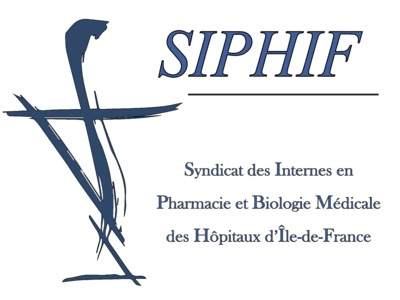
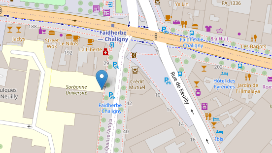

# Formation à l'intelligence artificielle en biologie médicale

  
  
  

  

## Présentation :
L'évolution rapide des technologies numériques, couplée à une augmentation exponentielle du volume de données hétérogènes (Big Data), notamment dans le domaine de la santé, soulève un défi majeur. Il est devenu impératif de préparer les futurs professionnels de santé à maîtriser ces outils et à comprendre leurs enjeux. En effet, les technologies numériques, incluant l'intelligence artificielle (IA), s'apprêtent à révolutionner divers secteurs en médecine.

## Intervenants :
**Dr Alexandre Godmer** (AHU, épartement de Bactériologie, site hôpital Saint-Antoine, Sorbonne-Université, INSERM, U1135, Centre d’Immunologie et des Maladies Infectieuses, Cimi-Paris, Paris).

**Dr Guillaume Bachelot** () 

## Infromations pratiques :

### Programme
- 2 demies journées de formation 
- **le 3 et 10 juin 2024** (après-midi)
- lieu de la formation : **Faculté de Santé Sorbonne Université Site Saint-Antoine; 27 Rue Chaligny (75012 Paris)**
- **Salle 1103 (11ème étage)**

  

### Pré-requis
**Création dun compte Google Colaratory**

 Colab (ou "Colaboratory") vous permet d'écrire et d'exécuter du code Python dans votre navigateur avec :

- aucune configuration requise
- accès sans frais aux GPU
- partage facile
- vidéo explicative : [lien](https://www.youtube.com/watch?v=inN8seMm7UI)

**Avant de commencer la formation, merci de remplir impérativement ce [questionnaire](https://forms.gle/T4JbXuKiTvR2Dz2W7)**
- Evaluation pré-formation : https://forms.gle/T4JbXuKiTvR2Dz2W7

### Cours et Travaux Pratiques

#### Petit lexique de l'intelligence artificielle : [lien](Cours/lexiqueIA.md)

#### Histoire de l'intelligence artificielle : [lien](Cours/HistoireIA.md)

#### Principes généraux de l'intelligence artificielle : [lien](Cours/PGIA.md)

#### Un premier pas vers l'intelligence artificielle : l'analyse en composante principale (ACP) [lien](Cours/HistoireIA.md)

#### Travaux pratiques

### Merci de remplir impérativement ces qestionnaires à la fin de la formation :
- Evaluation post-formation : [lien](https://forms.gle/BMfgQwdiQMFd1XJZ8)
- Evaluation qualiative : [lien](https://forms.gle/7t5U6ZEfNQ8B6Ax7A)
- Entretien focus-group : [lien](https://forms.gle/EfqNN5AKpHWHXUgZ7)
